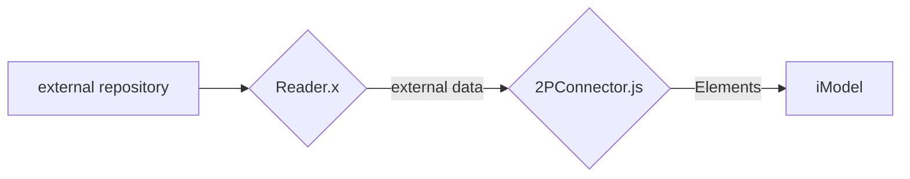

# Two-process (2P) connector design

A connector has 3 things to do:

1. _Read_ data from an external source
2. _Convert_ that data to BIS Elements
3. _Update_ the briefcase with new, changed, and deleted elements

Reading is concerned only with the mechanics of accessing external data. It must use whatever technology is appropriate for doing that.

Updating is concerned only with the mechanics of accessing the iModel. It must be written in Typescript and must use iModel.js.

Converting is the logic that stands in the middle. It understands both sides. It does the "alignment". Since it works with BIS elements, it must use iModel.js and must therefore be written in Typescript.

This leads to a two-process design for the connector:



The two processes communicate using gRPC (https://grpc.io/),

The implementation of "2PConnector" includes both the conversion and update functions. Since the conversion function is logically distinct from the update function, we separate them using subclassing.

Obviously, both the "Reader.x" program and the format-specific connector subclass must be specific to each external source and format. Nevertheless, the IPC mechanism between them can be general-purpose. Specifically, there is probably no need to make the gRPC declarations format-specific. Bentley provides a general-purpose gRPC interface (Reader) that should be sufficient for most 2-process connectors. Bentley also provides a general-purpose Connector base class (Base2PConnector) that implements the client-side IPC mechanics for this general-purpose interface. Each format-specific Reader.x program just has to implement this simple gRPC interface, and each format-specific connector sub-class has to override a few methods to convert the data.

The general-purpose gRPC interface is defined in `protobuf/Reader.proto`.

```protobuf
/* Query an external source.
 * The functions in this service are implemented by a non-iModel.js "reader" program. They are called by an iModel.js connector. They
 * give the iModel.js connector a way to fetch data from an external source that is not directly accessible to it. The "reader" program is the intermediary.
 * The main function is `getData`. The reader program should implement this by *streaming* all of the data in the external source back to the requesting connector.
 * The `onBriefcaseServerAvailable` function gives the reader the address of a service that is implemented by the iModel.js program. See briefcase.proto.
 * The reader program can use the briefcase service to send queries back to the connector. The reader can even send briefcase requests to the connector (and wait for answers)
 * while in the midst of handling a request from the connector.
 */
service Reader {
  /* Tell the reader to initialize. The input file to the connector is passed as a parameter, in case the Reader wants to open that or use it in some way. */
  rpc initialize(InitializeRequest) returns (InitializeResponse) {}
  /* Inform the Reader that a server is now available to take requests to query the briefcase */
  rpc onBriefcaseServerAvailable(OnBriefcaseServerAvailableParams) returns (google.protobuf.Empty);
  /* The Reader should send the data in the external source to the client (in a stream) */
  rpc getData(GetDataRequest) returns (stream GetDataResponse) {}
  /* The Reader should shut down */
  rpc shutdown(ShutdownRequest) returns (google.protobuf.Empty);
}
```

Note that the interface requires the Reader.x program to return the external data as a _stream_.
It is simple to generate server-side bindings for just about any language.

Here are some highlights of the Bentley general-purpose Base2PConnector. Note how it handles client-side IPC mechanics. It collaborates with the format-specific subclass to start the right server and to process the returned data.

```ts
import * as grpc from "@grpc/grpc-js";
import { ReaderClient } from "./generated/reader_grpc_pb";
import { GetDataRequest, GetDataResponse, InitializeRequest, InitializeResponse, ShutdownRequest, ShutdownResponse } from "./generated/reader_pb";
...

export abstract class Base2PConnector extends IModelBridge {

  // The base class can implement the client-side stubs. They can communicate with any Reader.x program.
  protected _readerClient?: ReaderClient;
  ...
  private async createClient(address: string): Promise<void> {
    this._readerClient = new ReaderClient(address, grpc.credentials.createInsecure());
    ...
  }

  // COLLABORATE: The sub-class must start the Reader.x program
  protected abstract startServer(addr: string): Promise<void>;

  // handle the IModelBridge.openSourceData callback by starting the server and connecting to it.
  public async openSourceData(sourcePath: string): Promise<void> {
    ...
    const rpcServerAddress = await getServerAddress();
    await this.startServer(rpcServerAddress); // COLLABORATE
    await this.createClient(rpcServerAddress);
    await this.doInitializeCallWithRetries(this._sourceFilename);
  }

  ...

  // COLLABORATE: The subclass calls this base-class method from its updateExistingData method to get data from Reader.x
  protected async fetchExternalData(onSourceData: any): Promise<void> {
    assert(this._readerClient !== undefined);
    const clientMessage = new GetDataRequest();
    const stream = this._readerClient.getData(clientMessage); // Reader.X *streams* the external data
    return new Promise((resolve, reject) => {
      stream.on("data", (response: GetDataResponse) => {
        onSourceData(response.getData()); // --> COLLABORATE: Invoke the supplied callback to process the data
      });
      stream.on("error", (err: Error) => {
        reject(err);
      });
      stream.on("end", () => {
        resolve();
      });
    });
  }

  ...
}
```

The customer can then write a format-specific subclass of Base2PConnector to implement the conversion logic for any given external format. For example:

```ts
export class Test2PConnector extends Base2PConnector {
  ...
  // COLLABORATE: Only I know what reader program to start.
  protected async startServer(addr: string): Promise<void> {
    const pyScript = path.join(__dirname, "Test2PReader.py");
    return launchPythonSever(pyScript, addr);
  }

  public async updateExistingData() {
    ... // update static stuff if need be

    // COLLABORATE: Request data from my external reader program and calls me back on each item that it returns
    await this.fetchExternalData((data: string) => {
      //  `data` is the raw data for an item that was fetched by Test2PReader.py
      const obj = JSON.parse(data);
      if (obj.objType === "Group") {
        this.convertGroupElement(obj, groupModelId);
      } else {
        const tileType = obj.tileType;
        this.convertTile(physicalModelId, definitionModelId, groupModelId, obj, tileType);
      }
    });

  private convertTile(physicalModelId: Id64String, definitionModelId: Id64String, groupModelId: Id64String, tile: any, shape: string) { ... }

  private convertGroupElement(group: any, groupModelId: Id64String): Id64String { ... }

  ...
  }

```

It can be a simple as that.

If the customer thinks the general-purpose streaming Reader interface is inadequate, the customer _can_ write a complete custom connector with customized gRPC declarations. It's not that hard.

## Reader.x -> 2PConnector.js Queries

It is also possible for the Reader.x program to send queries to the 2PConnector.js. The reader may even query the connector while it is in the midst of handling a request from the connector.

The connector implements the following service, as defined in `protobuf/Briefcase.proto`. The connector passes the address of this service to the reader's onBriefcaseServerAvailable method.

```protobuf
/* Query an iModel Briefcase.
 * The functions in this service allow a non-iModel.js server to get information from an open briefcase.
 * ExecuteECSql is the basic and most general method of querying the iModel.
 * TryGetElementProps is a simplified method to get the properties of an element.
 * GetExternalSourceAspectProps is specialized to getting the properties of an ExternalSourceAspect, and its results is strongly typed.
 * DetectChange is a short-cut query that looks up an ExternalSourceAspect by its external identity and checks its version or checksum.
 */
service Briefcase {
  /* Detect if the specified external data is mapped to an element and, if so, if the last-recorded state of the data is different from its current state. */
  rpc DetectChange(DetectChangeRequest) returns (DetectChangeResult) {}
  /* Look up an element in the iModel. */
  rpc TryGetElementProps(TryGetElementPropsRequest) returns (TryGetElementPropsResult) {}
  /* Get the properties of an ExernalSourceAspect. If not found, all of the properties of the returned object will have default values (i.e., elementId will be empty). See DetectChange for how to get the input externalSourceAspectId. */
  rpc GetExternalSourceAspectProps(GetExternalSourceAspectPropsRequest) returns (ExternalSourceAspectProps) {}
  /* Execute an ECSql statement */
  rpc ExecuteECSql(ExecuteECSqlRequest) returns (ExecuteECSqlResult) {}
}
```

Why support reader->connector queries? The reader may use these queries to get information about the state of the iModel to help it optimize the data that it returns in its getData function.
## Implementing a Reader.x program

### Python

https://grpc.io/docs/languages/python/

Install python.

Install the grpc tools and runtime support:
`python -m pip install grpc`

The server-side bindings that you will need have already been generated. They are:

```
+ src
  + generated
    + reader_pb2_grpc.py
    + reader_pb2.py
    + briefcase_pb2_grpc.py
    + briefcase_pb2.py
```

An empty implementation is here:
`src\test\assets\Test2PReader.py`

You can start with that and change it to access the external data that you need.

FYI It's much easier to develop a gRPC server when you have a test client making requests in the same process. Test2PReader.py shows an example of that.

## Sequence Diagram

Here is a detailed interaction diagram showing the a two-process connector running under the supervision of BridgeRunner. (Dashed lines indicate IPC calls or Web requests.)

```sequence
iModelHub -- BridgeRunner: permissions
BridgeRunner --> iModelHub: acquire briefcase
iModelHub --> BridgeRunner: briefcase
BridgeRunner ->> 2PConnector.js: Loads
BridgeRunner -> 2PConnector.js: openSourceData
2PConnector.js ->> Reader.x: Launches
2PConnector.js ->> Reader.x: initialize
Reader.x ->> 2PConnector.js: (failureReason)
2PConnector.js -> 2PConnector.js: (throw!)
Reader.x -> Reader.x: Start Reader gRPC server
Note right of Reader.x: may contact remote source\nmay start reading data\n...asynchronously...
BridgeRunner -> BridgeRunner: open briefcase
BridgeRunner -> 2PConnector.js: onOpenIModel
2PConnector.js -> 2PConnector.js: Start Briefcase gRPC server
2PConnector.js ->> Reader.x: onBriefcaseServerAvailable
Reader.x -->> 2PConnector.js: briefcase queries ...
2PConnector.js -->> Reader.x: ...
BridgeRunner --> iModelHub: lock schemas
BridgeRunner -> 2PConnector.js: importDomainSchema
2PConnector.js -> 2PConnector.js: import BIS domain schema(s)
BridgeRunner --> iModelHub: pushChanges
BridgeRunner -> 2PConnector.js: importDynamicSchema
2PConnector.js -> 2PConnector.js: import *fixed* domain schema(s)
BridgeRunner --> iModelHub: unlock schemas
BridgeRunner --> iModelHub: lock connector channel
BridgeRunner -> 2PConnector.js: importDefinitions
2PConnector.js -> 2PConnector.js: nop
BridgeRunner -> 2PConnector.js: updateExistingData
2PConnector.js -> 2PConnector.js: convert
2PConnector.js -->> Reader.x: getData
Note right of Reader.x: may contact remote source\nmay fetch remote data\n...
Reader.x -->> 2PConnector.js: *stream* of data
2PConnector.js -> 2PConnector.js: convert, detect changes,\nand update briefcase
2PConnector.js -> BridgeRunner: return
BridgeRunner -> BridgeRunner: saveChanges
BridgeRunner --> iModelHub: pushChanges
BridgeRunner --> iModelHub: unlock connector channel
```

The diagram may not make it clear that 2PConnector.js is reading from a *stream* of data produced by Reader.x. The reader and connector run in parallel. The reader is free to read the external data sequentially. There is no requirement that all data must be read before synchronization can proceed. Instead, the connector should convert and items as it receives them. The connector must be ready for items to arrive in *external source order*, not in iModel order.

## How to Simplify a Connector

Commonly a converter will not know what definitions or even what class definitions are needed until it is in the midst of reading the data. We must accommodate this. We put too much of a burden on the connector when we require it to discover and create all schemas and definitions ahead of time, before converting any data. We must allow the connector to create needed definitions as it goes along _without changing channels_.

Therefore, the 2P Connector should be restricted as follows:

The 2P Connector should not write to any shared models. Instead, it should write all definition elements to _private_ models in its private channel.

The 2P Connector should not _generate_ ECClasses. Instead, it should use the classes that are already defined in the BIS Core or domain schemas.

The 2P Connector should store format-specific properties as _aspects_ on elements.

The task of merging definitions from many different external sources into shared models is best left to the iModel transformer.

The iModel transformer can also remap elements to different classes, if that is desired.
