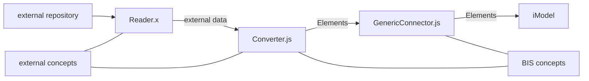

# Two-process (2P) connector design

This is a proposal for the design of a two-process (2P) connector. In the second section of the proposal, some key simplifications/restrictions are proposed, to make it less difficult to write such a connector. *I think the whole thing stands or falls on these simplifications.*

A 2P connector uses two _processes_. One process handles all access to the iModel, and it uses iModel.js. The other process handles all access to the external source. It uses any technology that is appropriate for that job. There is bi-directional IPC between the two.

A connector has *three* things to do: 1) read the external data, 2) convert the external data to BIS elements, and 3) write the elements to the iModel. There is a distinct component for each of these tasks in a 2P connector. They are:
#### Reader.x

- access and read external data

The Reader.x can be written in any language. It does not use iModel.js, and it does not access the iModel directly. It runs in its own process. It is denoted ".x" because it is external and may be in any language. It runs in its own external process.

#### Converter.js

- map external concepts into BIS schemas and classes
- convert external data into BIS elements (but does not write them)

Converter.js is, conceptually, in the middle.

- It is loaded and called by GenericContainer.js.
- It launches and communciates with Reader.x.
- It converts external data to BIS elements

Converter.js is distinct from Reader.x because it has different technology requirements. Since it works with BIS elements and classes, the Converter.js needs to use iModel.js. It is a kind of extension to the Connector.js, and so it is loaded into the iModel.js process.

#### GenericConnector.js

- implements IModelBridge
- update an iModel

GenericConnector.js is the connector proper. It implements the IModelBridge interface. It is loaded and run by BridgeRunner.

In its implementation of IModelBridge, GenericConnector.js loads and uses Converter.js as a kind of extension. Converter.js gets the external data and converts it. GenericConnector.js writes the converted data to the briefcase.

Here is how data and knowledge flow from one component to another:



.
Here is a detailed interaction diagram showing the three components at work. (Dashed lines indicate IPC calls or Web requests. Communication between Converter.js and Reader.x is bi-directional.)

```sequence
iModelHub -- BridgeRunner: permissions
BridgeRunner --> iModelHub: acquire briefcase
iModelHub --> BridgeRunner: briefcase
BridgeRunner ->> GenericConnector.js: Loads
GenericConnector.js ->> Converter.js: Loads
Converter.js -> Converter.js: Start gRPC IM server
BridgeRunner -> GenericConnector.js: openSourceData
Converter.js ->> Reader.x: Launches
Reader.x -> Reader.x: Start gRPC XS server
BridgeRunner -> BridgeRunner: open briefcase
BridgeRunner -> GenericConnector.js: onOpenIModel
BridgeRunner --> iModelHub: lock schemas
BridgeRunner -> GenericConnector.js: importDomainSchema
GenericConnector.js -> Converter.js: selectBisDomain
Converter.js -->> Reader.x: What BIS domain should we use?
Reader.x -->> Converter.js: BIS Domain name
Converter.js -> GenericConnector.js: BIS Domain name
GenericConnector.js -> GenericConnector.js: import BIS domain schema
BridgeRunner --> iModelHub: pushChanges
BridgeRunner -> GenericConnector.js: importDynamicSchema
GenericConnector.js -> GenericConnector.js: nop
BridgeRunner --> iModelHub: unlock schemas
BridgeRunner --> iModelHub: lock connector channel
BridgeRunner -> GenericConnector.js: importDefinitions
GenericConnector.js -> GenericConnector.js: nop
BridgeRunner -> GenericConnector.js: updateExistingData
GenericConnector.js -> Converter.js: convert
Converter.js -->> Reader.x: getData
Note right of Reader.x: start reading external source data (in source order)\nreturn a mixture of definitions and spatial data
Reader.x -->> Converter.js: isElementChanged?
Converter.js -->> Reader.x: Yes/No
Note right of Reader.x: May skip unchanged data
Reader.x -->> Converter.js: stream of data
Converter.js -> GenericConnector.js: isElementChanged?
GenericConnector.js -> Converter.js: Yes/No
Note right of Converter.js: May skip unchanged data
Converter.js -> Converter.js: maps external data to\ndomain schema classes
Converter.js -> GenericConnector.js: onElement
Converter.js -> GenericConnector.js: onModel
GenericConnector.js -> GenericConnector.js: detects Changes
GenericConnector.js -> GenericConnector.js: writes to briefcase
GenericConnector.js -> BridgeRunner: return
BridgeRunner -> BridgeRunner: saveChanges
BridgeRunner --> iModelHub: pushChanges
BridgeRunner --> iModelHub: unlock connector channel
```

The diagram may not make it clear that Converter.js is reading from a stream of data produced by Reader.x. Converter.js picks out data from the stream, converts it to elements and models, and invokes the onElement and onModel callbacks on GenericConnector.js as it goes along. The converter is free to skip unchanged items.

The Converter.js must implement the following methods for the GenericConnector.js to call:

```ts
interface Converter {
  selectBisDomain(): string;
  convert(callbacks: ConnectorCallbacks, services: ConnectorServices): void;
}
```

The generic connector expects the Converter.js to invoke a callback whenever it has converted an element or model.

```ts
interface ConnectorCallbacks {
  onElement(element: ElementProps, xsa: ExternalSourceAspectProps): Element;
  onModel(model: ModelProps, xsa: ExternalSourceAspectProps): Model;
  onElementSkipped(xsa: ExternalSourceAspectProps): void;
  onModelSkipped(xsa: ExternalSourceAspectProps): void;
}
```

In its onElement callback, the GenericConnector.js checks to see if the element or model has really changed and then writes it  to the briefcase.

The GenericConnector.js provides the following services to the Converter.js (and indirectly to the Reader.x):

```ts
interface ConnectorServices {
  isElementChanged(scope: Id64String, externalid: string): ExternalSourceAspect | undefined;
  isElementChangedByGuid(federationGuid: string): ExternalSourceAspect | undefined;
}
```

The isElementChanged methods allow the Converter.js (and, indirectly, the Reader.x) to check to see if an element already exists changes before going to the effort of converting it. Converter.js can ask the GenericConnector.js, and the Reader.x can send a request to Converter.js, which forwards it. So, all three components can do change-detection.

## Simplifications: No generated schemas, create definitions on the fly

Commonly a converter will not know what definitions or even what class definitions are needed until it is in the midst of reading the data. We must accommodate this. We put too much of a burden on the connector when we require it to discover and create all schemas and definitions ahead of time, before converting any data. We must allow the connector to create needed definitions as it goes along _without changing channels_.

Therefore, the 2P Connector should be restricted as follows:

The 2P Connector should not write to any shared models. Instead, it should write all definition elements to _private_ models in its private channel.

The 2P Connector should not _generate_ ECClasses. Instead, it should use the classes that are already defined in the BIS Core or domain schemas.

The 2P Connector should store format-specific properties as _aspects_ on elements.

The task of merging definitions from many different external sources into shared models is best left to the iModel transformer.

The iModel transformer can also remap elements to different classes, if that is desired.
