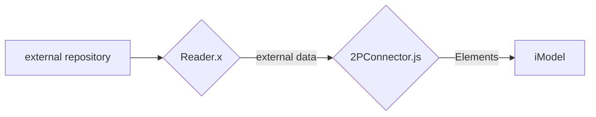

# Two-process (2P) connector design

This is a proposal for the design of a two-process (2P) connector.

A connector has 3 things to do:
1. *Read* data from an external source
2. *Convert* that data to BIS Elements
3. *Update* the briefcase with new, changed, and deleted elements

Reading is concerned only with the mechanics of accessing external data. It must use whatever technology is appropriate for doing that.

Updating is concerned only with the mechanics of accessing the iModel. It must be written in Typescript and must use iModel.js.

Converting is the logic that stands in the middle. It understands both sides. It does the "alignment". Since it works with BIS elements, it must use iModel.js and must therefore be written in Typescript.

This leads to a two-process design for the connector:

The two processes communicate using gRPC.

The implementation of "2PConnector" includes both the conversion and update functions. Since the conversion function is logically distinct from the update function, we separate them using subclassing. We can write a general purpose base class that encapsulates the update (and IPC) mechanics. The customer can then write a subclass of that to implement the conversion logic for any given external format.

Obviously, the "Reader.x" program must be specific to each external source. The format-specific connector subclass has to understand the external data that the reader sends over the wired. Nevertheless, the subclass can leave the IPC/gRPC mechanics to the base class. There is generally no need to make the gRPC declarations format-specific. (Or, the customer can write a custom connector with customized gRPC declarations. That's doable, if that's what the customer wants to do.)

## Design Restrictions

Commonly a converter will not know what definitions or even what class definitions are needed until it is in the midst of reading the data. We must accommodate this. We put too much of a burden on the connector when we require it to discover and create all schemas and definitions ahead of time, before converting any data. We must allow the connector to create needed definitions as it goes along _without changing channels_.

Therefore, the 2P Connector should be restricted as follows:

The 2P Connector should not write to any shared models. Instead, it should write all definition elements to _private_ models in its private channel.

The 2P Connector should not _generate_ ECClasses. Instead, it should use the classes that are already defined in the BIS Core or domain schemas.

The 2P Connector should store format-specific properties as _aspects_ on elements.

The task of merging definitions from many different external sources into shared models is best left to the iModel transformer.

The iModel transformer can also remap elements to different classes, if that is desired.
